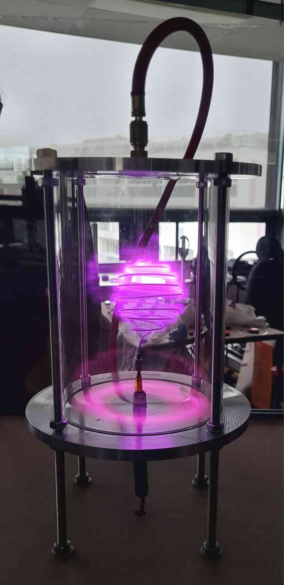
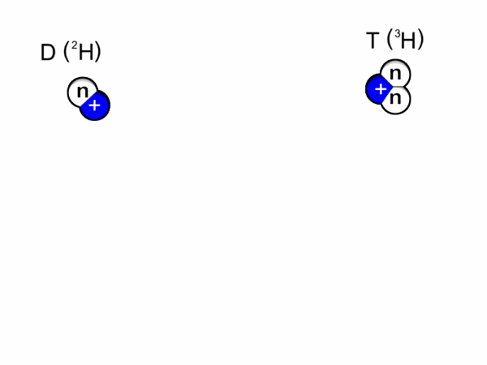
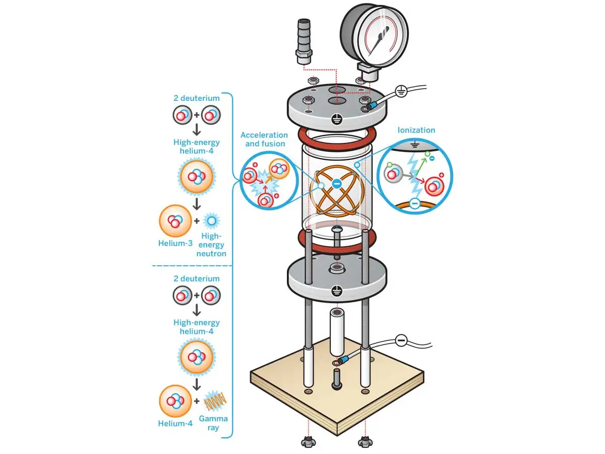
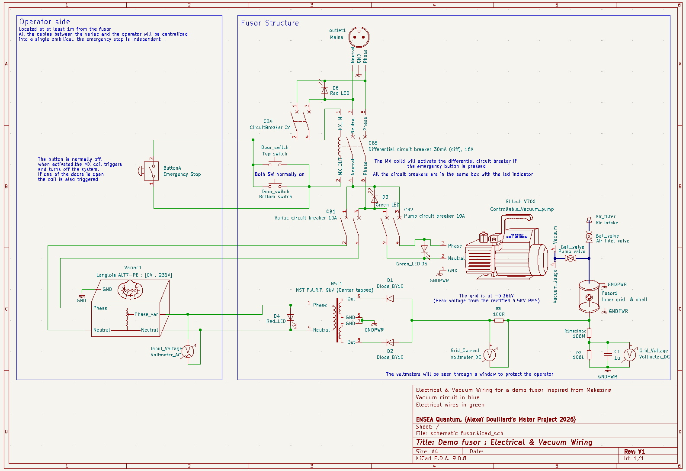
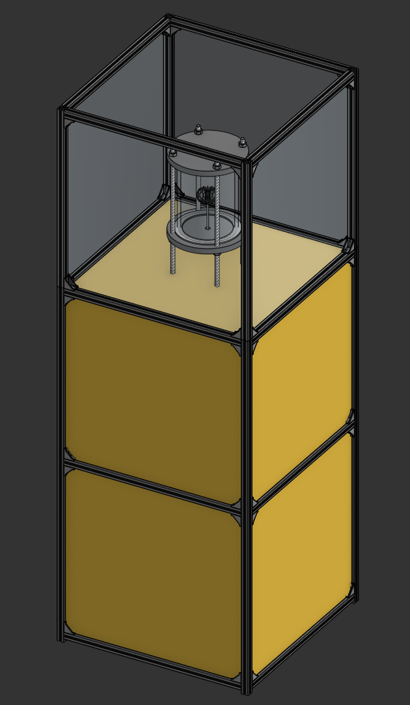

# 2526_Maker_Fusor
Projet ENSEA Option Maker 2026 Alexeï Douillard

## Objectif et contexte:
Au sein de l'association ENSEA Quantum nous avons réalisé un démonstrateur de fusor afin de pouvoir montrer comment contenir la réaction se produisant au sein des étoiles. Pour des raisons de sécurité, nous ne souhaitons pas atteindre la fusion mais juste créer un plasma.

  

### Qu'est ce que la fusion ? 
La fusion est une réaction nucléaire qui combine des atomes légers pour en former des plus lourd. C'est cette réaction qui alimente les étoiles et donc la quasi totalilité de l'énergie sur terre vien indirectement de la fusion. La fusion produit de l'énergie pour les atomes plus léger que le fer comme le deutérium par exeple (un isotope de l'hydrogène composé d'un proton et d'un neutron). L'énergie obtenue vient de la différence de masse entre l'ensemble des atomes léger réagissant et la masse de l'ensemble des produits. Lors de la réaction la masse totale des produits est légèrement inférieure à celle des réactifs, même si cette différence est infime obtient de l'énergie et pas qu'un peu ! D'après la fameuse équation : $\ E = mc^2$. Attention il ne faut pas confondre cette réaction avec la fission qui est le principer inverse, casser des atomes très lourds pour libérer de l'énergie. Les produits de la fusion contrairemenr à la fission n'on pas une demi vie radiocative très élevée

  

### Pourquoi un fusor ? 
Un fusor est le réacteur le plus simple pour produire de la fusion, inventé par Philo T. Farnsworth. dans les années 50 et ensuite modifié par son collègue Robert L. Hirsch. Il est suffisament simple pour être construit par des amateurs. L'objectif d'un vrai fusor est d'attirer des noyaux de deuterium avec une électrode pour qu'ils entrent en collision et qu'ils fusionnent. C'est la fusion par confinement inertiel électrostatique. Pour cela il faut que les particules soient sous forme de plasma pour être chargé électriquement et elle doivent pouvoir accélerer suffisament longtemps pour avoir l'énergie suffisante pour fusionner. Pour cela il faut dans les placer dans des conditions extrêmes c'est à dire un quasi vide avec une tension de plusieurs dizaines de kilovolts !.

### C'est pas dangereux ce machin ? 
Nous cherchons ici à fabriquer un démonstrateur de fusor et non le véritable réacteur nous n'utiliserons donc pas de deuterium ni de tensions supèrieures à 5kV (pour la fusion du deuterium une tension de 30kV est recommandée). Notre objectif est d'obtenir un plsama en ionisant l'air. Nous ne produiront donc pas de neutrons et très peu de X-ray qui seront absorbés par le verre. Cependant cela reste un projet nécessitant de nombreuses mesures de sécurité que ce soit pour les hautes tensions ou la construction de la chambre à vide. Pour cela nous avons ajouté des systèmes de sécurités tel qu'un différentiel, des disjoncteurs, un bouton d'arret d'urgence et un système de coupure quand l'une des portes est ouverte

## Le Plan :

### L'architecture 
Nous avons suivit l'architecture suivante : [Tutoriel de Makezine](https://makezine.com/projects/nuclear-fusor/)

La réaction montré sur le schéma suivant est celle des véritables fusors, le notre n'a que la capacité d'ioniser l'air.

  

****Toutes les références et datasheets sont accéssibles dans le dossier Documentation****

Pour fournir la tension requise nous allons utiliser un transformateur de néon f.a.r.t. de 9kV limité à 100mA (les test ont été pour l'instant réalisé sur un transformateur de 10kV limité à 25mA pour ne pas faire surchauffer la bougie) ce dernier est alimenté et controllé par un variac Langlois alt7-PE capable de fournir une tension alternative entre 0 et 230V.
En sortie du transformateur, après un redressement par diode haute tension (diode by16 pouvant aller jusqu'à 16kv avec un courant moyen de 300mA)  la borne positive est connectée à la terre qui est reliée aux plaques en aluminium en haut et en bas du fusor et la borne moins est l'électrode au centre de l'appareil. Cela va nous permettre d'obtenir une différence de potentiel de -4.5kV entre l'électrode et le corps du fusor.

Cette tension n'est en pratique pas atteinte car nous ne pouvons pas attteindre un pression suffisament faible pour retrouver une grande resistivité dans le plasma. Notre plasma est donc conducteur ce qui empèche d'avoir une différence de potentielle maximale.

Nous allons tout de même essayer d'avoir des mesures plus fiables sur la tension d'entrée ainsi que la pression au sein de la chambre comparé au tutoriel. Pour cela nous allons ajouter un pont diviseur de tensiona l'aide une résistance de 100 M$\Omega$ entre le voltmètre et le fusor

**Voici le schéma du montage :** 

*(il peut être trouvé sous format PDF dans le dossier "Diagramme électrique" et les datasheets sont accessibles en appuyant sur "D" après avoir sélectionné un composant sur le fichier schématique Kicad du même dossier)*

**Le fusor sera dans le boitier suivant :**

  

La structure est assemblée grâce à des rails en aluminium de 20mm. La structure fait 1.5m de haut par 54 cm de large.
Le fusor en lui même est dans un cylindre de 7mm d'épaisseur de borosilicate (verre très résistant aux hautes températures) avec 2 plaques d'aluminium comme couvercles. Le tout est entouré de 4 plaques de PETG ajoutent une couche de protection supplémentaire et bloquent les UV.
Le compartiment intermédiaire héberge la pompe à vide ainsi que le boitier électrique. La partie infèrieure stockera le transformateur et permettra aussi le rangement du Variac quand la machine n'est pas utilisée.

La vidéo est disponible aussi en plus haute qualité  [ici](Vidéos/Tour_fusor.mp4)

  

## Extras :
### Liste des compétences utilisés :

#### Compétences techniques
* Conception 3D
* Schématique électrique Kicad pour recenser les références
* Decoupe Laser (et configuration pour de nouveaux materiaux : PETG)
* Gravure à la laser
* Impression 3D bicolore
* Assemblage de rails d'aluminium
* Assemblage de chambre à vide
* Soudure à l'étain
* Isolation à la résine
* Utilisation de JB-Weld : soudure à froid utilisant une colle d'epoxy
* Découpe de joints au scalpel avec gabarit
* Découpe à la scie et à la scie sauteuse
* Perceuse avec cloche
* Sertissage 
* Filetage externe et interne
* Cablage de boitier électrique
* Thermodeformation de plastique et de gaines
* Tyauterie pour vide (teflon, valves, entrées d'air, pompe à vide)
* Cablage Hautes tension
* Tests d'élec de puissance
* Tressage de cable
* Reroutage de variac
* Connectique sur bougie d'allumage
* sculpture de fil d'acier grâce à une base imprimée en 3D
* Colle chaude
* Sauvetage d'équipement de mesure des poubelles de l'ENSEA

#### Gestion de projet
* Recherche d'informations
* Selection de composants
* Commandes de composants
* Rédaction d'un Github
* Démarches juridiques pour la passation du fusor
* Disscution avec les techniciens pour la réalisation des pièces spécifiques

#### Fait par des techniciens
* Tour à métaux
* Brasure sur bougie
* Découpe précise joints

## Liens intéressants :

La grande majorité des sources provient de [fusor.net](fusor.net)

### Projet similaires :

[Conseils sur la construction d'un demo fusor similaire](https://fusor.net/board/viewtopic.php?p=106889&hilit=make%3Amagazine#p106889)

### Materiaux et calculs
[Calcul de la pression supportée par le borosylicate](https://www.vidrasa.com/eng/products/duran/duran_pf.html) 
J'obtient une résistance à 7.8 Bar avec un diamètre de 150 mm et une épaisseur de 8mm

[infos sur les chambres à vide et les capteurs](https://bt.e-ditionsbyfry.com/publication/?i=263977&p=22&view=issueViewer)

### Sécurité : 

Notre grille va concentrer les flux d'électrons vers les plaques en acier pour eviter un effet de focus sur les paroies
[Utilisation du borosilicate et risques ](https://fusor.net/board/viewtopic.php?t=15780)

Notre installation ne produira pas une quantitée dangereuses de X-Ray car nous ne dépasserons pas les 10kV lors de nos essais.
[X-Rays produits](https://fusor.net/board/viewtopic.php?p=33810&hilit=radiation+with+12kv#p33810)

### Rétroplanning : (un peu très beaucoup dépassé : le projet a abouti le 5 mai)
| Objectif | Date de début | Temps requis|
|:--------:|:--------:|:--------:|
| Deadline     | 13 Avril   | N/A  |
| Marge    | 6 Avril  | 1 semaine    |
| Assemblage électrique et isolation   |  30 Mars   | 1 semaines  |
| Test de la chambre à vide | 23 Mars   | 1 semaines   |
| Construction de la chambre à vide   | 16 Mars   | 2 semaine   |
| Construction de l'établi | 9 Mars| 1 semaine|
| Design de l'établit (table de support) | 23 Février  | 2 semaine|
| Commande des composants| 16 février |1 semaine|
| Design 3D des disques en acier| 9 février| 1 semaine|