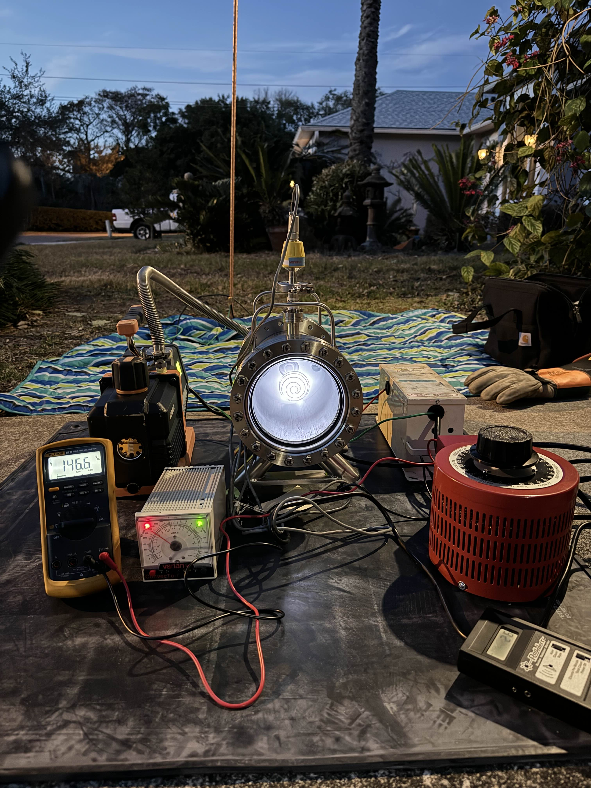
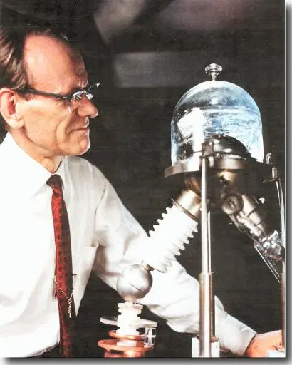

# 2526_Maker_Fusor
Projet ENSEA Option Maker 2026 Alexeï Douillard

## Objectif et contexte:
Au sein de l'association ENSEA Quantum nous souhaitons réaliser un démonstrateur de fusor afin de pouvoir montrer comment contenir la réaction se produisant au sein des étoiles. Nous ne souhatons pas atteindre la fusion mais juste créer un plasma pour des raisons de sécurité.

### Qu'est ce que la fusion ? 
La fusion est une réaction nucléaire qui combine desa atomes légers pour en former des plus lourd. C'est cette réaction qui alimente les étoiles et donc la quasi totalilité de l'énergie sur terre vien indirectement de la fusion. La fusion produit de l'énergie pour les atomes plus léger que le fer comme le deutérium par exeple (un isotope de l'hydrogène composé d'un proton et d'un neutron). L'énergie obtenue vient de la différence de masse entre l'ensemble des atomes léger réagissant et la masse de l'ensemble des produits. Lors de la réaction la masse totale des produits est légèrement inférieure à celle des réactifs, même si cette différence est infime obtient de l'énergie et pas qu'un peu ! D'après la fameuse équation : $\ E = mc^2$. Attention il ne faut pas confondre cette réaction avec la fission qui est le principer inverse, casser des atomes très lourds pour libérer de l'énergie. Les produits de la fusion contrairemenr à la fission n'on pas une demi vie radiocative très élevée

### Pourquoi un fusor ? 
Un fusor est le réacteur le plus simple pour produire de la fusion, inventé par Philo T. Farnsworth. dans les années 50 et ensuite modifié par son collègue Robert L. Hirsch. Il est suffisament simple pour être construit par des amateurs. L'objectif d'un vrai fusor est d'attirer des noyaux de deuterium avec une électrode pour qu'ils entrent en collision et qu'ils fusionnent. C'est la fusion par confinement inertiel électrostatique. Pour cela il faut que les particules soient sous forme de plasma pour être chargé électriquement et elle doivent pouvoir accélerer suffisament longtemps pour avoir l'énergie suffisante pour fusionner. Pour cela il faut dans les placer dans des conditions extrêmes c'est à dire un quasi vide avec une tension de plusieurs dizaines de kilovolts !.

### C'est pas dangereux ce machin ? 
Nous cherchons ici à fabriquer un démonstrateur de fusor et non le véritable réacteur nous n'utiliserons donc pas de deuterium ni de tensions supèrieures à 12kV (pour la fusion du deuterium une tension de 30kV est recommandée). Nous ne produiront donc pas de neutrons et très peu de X-ray cependant cela reste un projet nécessitant de nombreuses mesures de sécurité que ce soit pour les hautes tensions ou la construction de la chambre à vide. Nous avons  investit dans des équipements de protection personnel et nous allons faire vérifier notre installation avant tout allumage par nos professeurs encadrants.

## Le Plan :

### L'architecture 
Nous allons suivre l'architecture suivante : [Tutoriel de Makezine](https://makezine.com/projects/nuclear-fusor/)

La réaction montré sur le schéma suivant est celle des véritables fusors, le notre n'aura que la capacité d'ioniser l'air.

Nous allons tout de même essayer d'avoir des mesures plus fiables sur la tension d'entrée ainsi que la pression au sein de la chambre comparé au tutoriel.

Pour fournir la tension requise nous allons utiliser un transformateur de néon controllé par un variac.
En sortie du transformateur, après un redressement par diode haute tension nous allons connecter la borne plus à la terre qui est reliée aux plaques en acier en haut et en bas du fusor et la borne moins est l'électrode au centre de l'appareil. Cela va nous permettre d'obtenir une différence de potentiel de -10kV entre l'électrode et le corps du fusor

### Rétroplanning :
| Objectif | Date de début | Temps requis|
|:--------:|:--------:|:--------:|
| Deadline     | 13 Avril   | N/A  |
| Marge    | 6 Avril  | 1 semaine    |
| Assemblage électrique et isolation   |  30 Mars   | 1 semaines  |
| Test de la chambre à vide | 23 Mars   | 1 semaines   |
| Construction de la chambre à vide   | 16 Mars   | 2 semaine   |
| Construction de l'établi | 9 Mars| 1 semaine|
| Design de l'établit (table de support) | 23 Février  | 2 semaine|
| Commande des composants| 16 février |1 semaine|
| Design 3D des disques en acier| 9 février| 1 semaine|

## Liens intéressants :

La grande majorité des sources provient de [fusor.net](fusor.net)

### Projet similaires :

[Conseils sur la construction d'un demo fusor similaire](https://fusor.net/board/viewtopic.php?p=106889&hilit=make%3Amagazine#p106889)

### Materiaux et calculs
[Calcul de la pression supportée par le borosylicate](https://www.vidrasa.com/eng/products/duran/duran_pf.html) 
J'obtient une résistance à 7.8 Bar avec un diamètre de 150 mm et une épaisseur de 8mm

### Sécurité : 

Notre grille va concentrer les flux d'électrons vers les plaques en acier pour eviter un effet de focus sur les paroies
[Utilisation du borosilicate et risques ](https://fusor.net/board/viewtopic.php?t=15780)

Notre installation ne produira pas une quantitée dangereuses de X-Ray car nous ne dépasserons pas les 10kV lors de nos essais.
[X-Rays produits](https://fusor.net/board/viewtopic.php?p=33810&hilit=radiation+with+12kv#p33810)